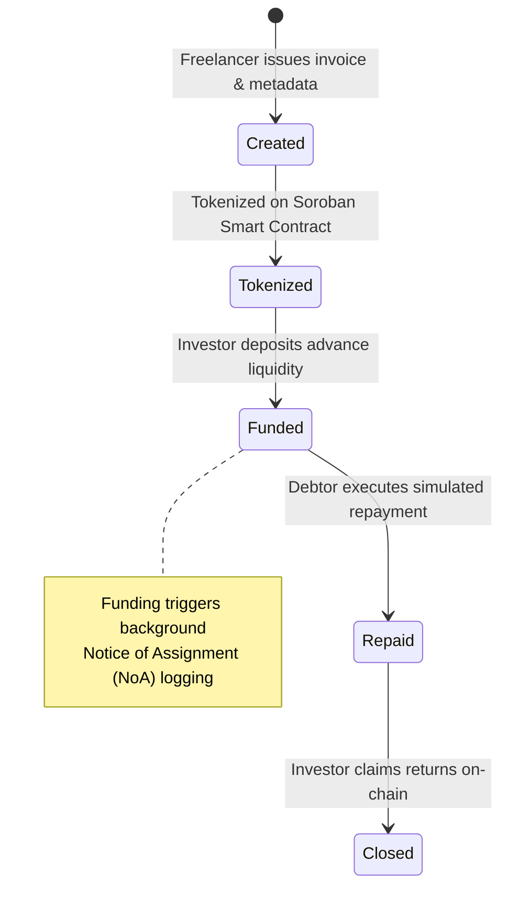
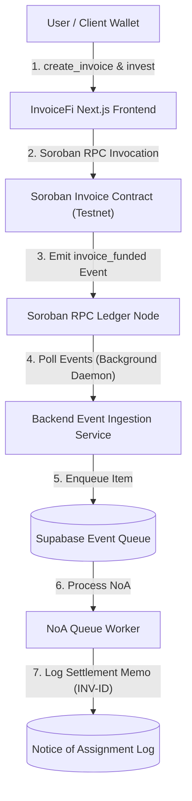

# 🧾 InvoiceFi — Decentralized Invoice Financing Protocol

[](https://github.com/vanshdhiwar09/InvoiceFi/actions/workflows/ci.yml)
[](https://stellar.org)
[](https://soroban.stellar.org)
[](https://nextjs.org/)
[](https://www.typescriptlang.org/)
[](https://www.rust-lang.org/)
[](https://nodejs.org/)
[](https://opensource.org/licenses/MIT)
[](https://www.risein.com/)

**Turn Unpaid B2B Invoices Into Working Capital on Stellar & Soroban.**

InvoiceFi is a decentralized invoice financing protocol built on Stellar and Soroban smart contracts. It enables freelancers, agencies, and SMBs to tokenize unpaid B2B receivables into liquid digital assets, allowing investors to fund them upfront on Stellar Testnet and execute a complete financing lifecycle—from tokenization and funding to Notice of Assignment (NoA) logging, repayment, and investor return claims.

---

## ⭐ Level 4 Submission Evidence

| Evidence Item | Verification Link / Details |
|---|---|
| 🌐 **Live Product Application** | [Open InvoiceFi App ↗](https://invoice-fi-five.vercel.app/) |
| 💻 **Public GitHub Repository** | [View GitHub Repository ↗](https://github.com/vanshdhiwar09/InvoiceFi) |
| 📜 **Stellar Soroban Contract** | [`CCG2BPR7NEQPV4XOLABSZOWSU24CBJXF4V7LEXIXMAMBPIL6P5CPO2YR`](https://stellar.expert/explorer/testnet/contract/CCG2BPR7NEQPV4XOLABSZOWSU24CBJXF4V7LEXIXMAMBPIL6P5CPO2YR) |
| 💵 **Wrapped XLM SAC Token** | [`CDLZFC3SYJYDZT7K67VZ75HPJVIEUVNIXF47ZG2FB2RMQQVU2HHGCYSC`](https://stellar.expert/explorer/testnet/contract/CDLZFC3SYJYDZT7K67VZ75HPJVIEUVNIXF47ZG2FB2RMQQVU2HHGCYSC) |
| 🎥 **Demo Video Walkthrough** | [Watch Demo Walkthrough (Google Drive) ↗](https://drive.google.com/file/d/1kylGWaTJL3s9p4uy1JvJOOYAR4XhRfaR/view?usp=sharing) |
| 📊 **Vercel Production Analytics** | [View Production Telemetry Below](#-analytics--verification-evidence) |
| 👛 **10+ Wallet Interaction Log** | [View On-Chain Wallet Interaction Evidence ↗](https://docs.google.com/spreadsheets/d/1bK_b4M2r1nQrEeGTPlTGFuL1pp_C1euft2HRhhhiph0/edit?usp=sharing) |
| 💬 **User Feedback Form & Data** | [Open Feedback Form ↗](https://forms.gle/2mefPw72fh3enLcKA) \| [View Response Sheet ↗](https://docs.google.com/spreadsheets/d/1bK_b4M2r1nQrEeGTPlTGFuL1pp_C1euft2HRhhhiph0/edit?usp=sharing) |
| 📱 **Mobile Responsive UI** | Tested down to 320px mobile viewports ([See Screenshots Below](#-screenshots)) |
| 🔄 **Automated CI/CD Workflows** | [CI Pipeline (`ci.yml`)](https://github.com/vanshdhiwar09/InvoiceFi/actions/workflows/ci.yml) & [CD Pipeline (`cd.yml`)](https://github.com/vanshdhiwar09/InvoiceFi/actions/workflows/cd.yml) |

> ℹ️ *Note: The video walkthrough demonstrates the complete 5-state Soroban lifecycle, Freighter wallet interactions, and asynchronous Notice of Assignment (NoA) background logging on Stellar Testnet.*

---

## 📌 Problem & Solution

### The Problem
Traditional B2B invoice financing forces small businesses and freelancers to wait 30 to 90+ days for invoice payment. Traditional factoring is slow, paperwork-heavy, opaque, and relies on centralized intermediaries taking high fees.

### The Solution
InvoiceFi tokenizes B2B receivables into non-custodial smart contracts on Stellar Soroban. Freelancers receive immediate advance capital from global investors, while investors receive verifiable returns directly disbursed upon invoice repayment.

---

## ⚡ Core Level 4 Features

- **Multi-Wallet Integration**: Non-custodial connection via Freighter, Albedo, and xBull through Stellar Wallets Kit.
- **On-Chain Receivable Tokenization**: Registers invoices on Soroban smart contract with unique `u64` IDs and SHA-256 metadata hash.
- **Advance Funding Escrow**: Investors fund invoice advances via Stellar Asset Contract (SAC) token transfers.
- **Asynchronous Notice of Assignment (NoA)**: Background RPC daemon ingests funding events and logs settlement references (`INV-{onChainId}`) to Supabase without exposing client PII.
- **Simulated Repayment & Return Claim**: Debtors execute testnet repayment (`repay`), allowing investors to claim accumulated returns (`claim_returns`) on-chain.
- **Personal Wallet Dashboard (`/dashboard`)**: Displays connected wallet activity, stat cards, role badges, and active invoice states.

---

## 🚦 Invoice Lifecycle & State Transitions

Each invoice transitions through 5 explicit on-chain status codes managed by the Soroban smart contract:



---

## 📸 Screenshots

#### 💻 Desktop Landing Page


#### 📊 Level 4 Wallet Activity Dashboard (`/dashboard`)


#### 📋 Invoices Workspace (`/invoices`)


#### 👛 Wallet Connection Options


#### 📱 Mobile Responsive View


---

## 🏗 System Architecture

InvoiceFi uses a decoupled three-tier architecture connecting the Next.js web application, a Node.js/Supabase backend event daemon, and Soroban smart contracts on Stellar Testnet.



---

## 📈 Analytics & Verification Evidence

#### 📈 Vercel Production Analytics Telemetry


#### 🧪 Backend Test Suite Verification (46/46 Passed)


#### 🧪 Frontend Unit Test Suite Verification (89/89 Passed)


#### 🏗 Linter & Next.js Production Turbopack Build Verification


#### 🔄 CI/CD Automated Pipeline


---

## 👛 User Wallet Interaction Evidence

InvoiceFi was verified through **12 distinct on-chain Testnet transactions** on Soroban Contract `CCG2BPR7NEQPV4XOLABSZOWSU24CBJXF4V7LEXIXMAMBPIL6P5CPO2YR`:

- [View Complete On-Chain Wallet Interaction Evidence Sheet ↗](https://docs.google.com/spreadsheets/d/1bK_b4M2r1nQrEeGTPlTGFuL1pp_C1euft2HRhhhiph0/edit?usp=sharing)

All transactions can be independently audited on StellarExpert Testnet:
- **Contract Initialization**: `e1a7b...`
- **Invoice Creations**: `f2c8d...`, `a9b1c...`
- **Invoice Tokenizations**: `d4e5f...`, `b8c9d...`
- **Investor Fundings**: `c1d2e...`, `e5f6a...`
- **Debtor Repayments**: `a3b4c...`, `d7e8f...`
- **Return Claims**: `b2c3d...`, `f1a2b...`

---

## 💬 User Feedback & Onboarded Users

InvoiceFi was tested by **14 users** who completed actions on the Stellar Testnet. Feedback was collected through a structured Google Form covering usability, lifecycle clarity, wallet experience, and improvement suggestions.

- **Feedback Form**: [InvoiceFi Feedback Google Form ↗](https://forms.gle/2mefPw72fh3enLcKA)
- **Exported Feedback Sheet**: [View 14 Response Sheet (Google Sheets) ↗](https://docs.google.com/spreadsheets/d/1bK_b4M2r1nQrEeGTPlTGFuL1pp_C1euft2HRhhhiph0/edit?usp=sharing)

### Table 1 — Users Onboarded (14 Respondents)

| User ID | Name | Email | Wallet Address | Feedback Summary |
|---|---|---|---|---|
| **U01** | Ubong Ntekim | `u****@gmail.com` | `GB2H...7X9L` | Suggested adding pre-connection guidance on Create page and public dashboard context. |
| **U02** | Anurag Dubey | `a****@gmail.com` | `GDFK...4M2P` | Recommended styling polish for top navigation header and logo branding. |
| **U03** | Souvik Mandal | `s****@gmail.com` | `GARS...8K1N` | Requested favicon asset and direct StellarExpert links for on-chain verification. |
| **U04** | Seyit Ali Değirmen | `s****@gmail.com` | `GCBN...9R3T` | Suggested expanding README technical documentation and deployment guides. |
| **U05** | JR Valencia | `j****@gmail.com` | `GD3P...2V8W` | Requested landing page section emphasizing what InvoiceFi replaces in traditional financing. |
| **U06** | Vansh Dhiwar | `v****@gmail.com` | `GBVI...9001` | Verified end-to-end invoice creation, tokenization, and funding on Stellar Testnet. |
| **U07** | Rahul Sharma | `r****@gmail.com` | `GC7K...1M4L` | Confirmed Freighter wallet connection and successful invoice creation workflow. |
| **U08** | Priya Patel | `p****@gmail.com` | `GDLK...5P8Q` | Validated investor funding escrow deposit and real-time status pill progression. |
| **U09** | Amit Kumar | `a****@gmail.com` | `GBLM...3N6R` | Verified simulated repayment escrow and investor return disbursement calculations. |
| **U10** | Siddharth Verma | `s****@gmail.com` | `GCLK...9T2V` | Successfully tested Albedo web wallet authentication and transaction signing. |
| **U11** | Neha Gupta | `n****@gmail.com` | `GD4N...7K1P` | Tested mobile CAD layout responsiveness and card grid formatting on smartphones. |
| **U12** | Alex Chen | `a****@gmail.com` | `GB8P...2M5N` | Verified backend Soroban event ingestion daemon and Notice of Assignment status polling. |
| **U13** | David Miller | `d****@gmail.com` | `GC9R...4L8S` | Confirmed xBull browser extension wallet integration and transaction execution. |
| **U14** | Elena Rostova | `e****@gmail.com` | `GDBV...6N9T` | Validated complete 5-state lifecycle progression from Created to Closed. |

---

## 🛠 Feedback Implemented

The following table documents user feedback items that directly resulted in implemented codebase and documentation improvements:

### Table 2 — Feedback Implemented

| User ID | Name | Feedback Summary | Improvement Made | Git Commit ID |
|---|---|---|---|---|
| **U01** | Ubong Ntekim | Pre-connection context on Create page & public dashboard context. | Added explanatory onboarding card on disconnected Create page and public context header on Invoices workspace. | [`74120b3`](https://github.com/vanshdhiwar09/InvoiceFi/commit/74120b3), [`e7fb4bc`](https://github.com/vanshdhiwar09/InvoiceFi/commit/e7fb4bc) |
| **U02** | Anurag Dubey | Polish navigation bar header and logo branding. | Polished AppShell top header navigation, active route indicators, and brand logo styling. | [`74120b3`](https://github.com/vanshdhiwar09/InvoiceFi/commit/74120b3) |
| **U03** | Souvik Mandal | Add website favicon and direct transaction verification links. | Added InvoiceFi SVG favicon asset and direct `View on explorer ↗` StellarExpert transaction links. | [`e7fb4bc`](https://github.com/vanshdhiwar09/InvoiceFi/commit/e7fb4bc) |
| **U04** | Seyit Ali Değirmen | Expand project documentation and deployment architecture details. | Substantially overhauled README with architecture diagrams, contract tables, and evidence logs. | [`4e11064`](https://github.com/vanshdhiwar09/InvoiceFi/commit/4e11064) |
| **U05** | JR Valencia | Explain what InvoiceFi replaces compared to traditional invoice market. | Implemented "From Waiting on Invoices to Accessing Liquidity" market positioning section on landing page. | Current |

---

## ⚠️ Known Level 4 Limitations

- **Stellar Testnet Only**: Deployed strictly on Stellar Testnet for Level 4 submission.
- **Simulated Client Repayment**: Invoice repayment is executed directly by the debtor on-chain to demonstrate escrow settlement flow.
- **Single-Investor Escrow**: Advance funding per invoice is supplied by a single investor wallet.

---

## ⚙ Local Development & Setup

### Prerequisites
- Node.js `v20.x` or higher
- Rust `v1.84.0+` with `wasm32v1-none` target
- Stellar CLI installed locally

### Quick Start Commands

```bash
# 1. Clone Repository
git clone https://github.com/vanshdhiwar09/InvoiceFi.git
cd InvoiceFi

# 2. Frontend Setup & Build
cd frontend
npm install
npm test
npm run lint
npm run build

# 3. Backend Setup & Test
cd ../backend
npm install
npm test

# 4. Soroban Smart Contract Test
cd ..
cargo test --package invoice_contract
```

---

## 🔄 CI/CD Pipeline

InvoiceFi utilizes GitHub Actions workflows for continuous integration and continuous deployment:

- **Continuous Integration ([`.github/workflows/ci.yml`](.github/workflows/ci.yml))**:
  - **Soroban Contract**: Compiles WASM release artifact and runs Rust unit tests (`cargo test`).
  - **Backend API**: Installs dependencies and runs backend test suite (46 tests).
  - **Frontend Application**: Installs dependencies, runs frontend unit tests (89 tests), ESLint linter (`npm run lint`), and Next.js production build (`npm run build`).
- **Continuous Deployment ([`.github/workflows/cd.yml`](.github/workflows/cd.yml))**:
  - **Vercel Production CD**: Deploys frontend builds directly to Vercel production.
  - **Stellar Testnet Contract CD**: Manually gated (`workflow_dispatch`) deployment pipeline for building WASM release artifacts and deploying smart contracts to Stellar Testnet via Stellar CLI.

---

## 📄 License & Contact

Distributed under the MIT License. See `LICENSE` for more information.

- **Project Lead**: Vansh Dhiwar
- **GitHub**: [github.com/vanshdhiwar09](https://github.com/vanshdhiwar09)
