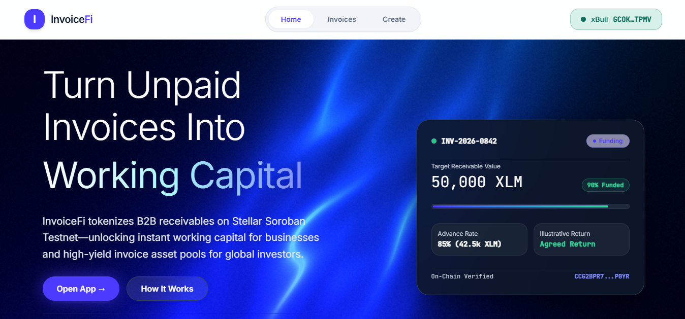
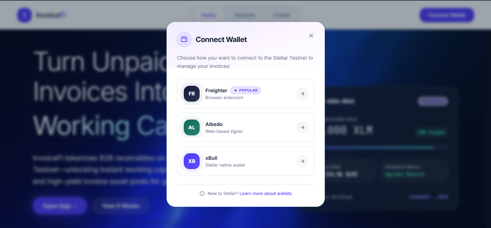
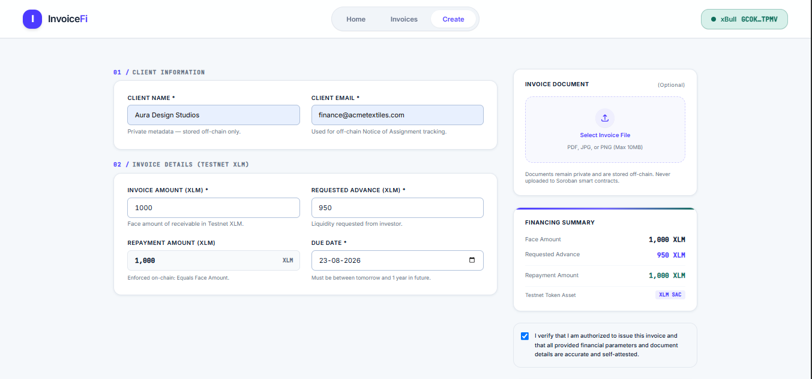
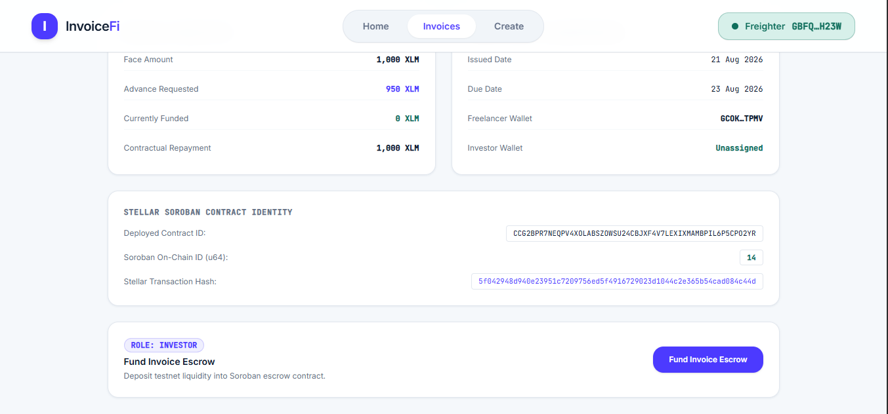
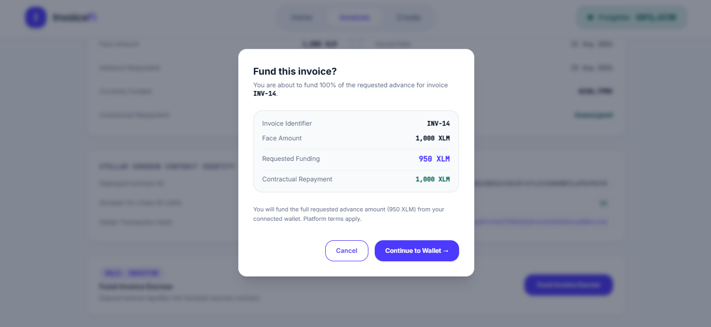
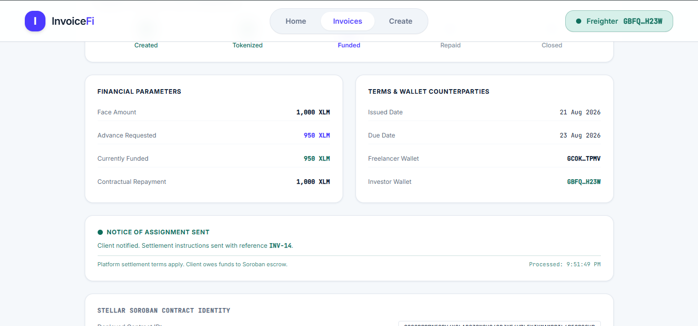
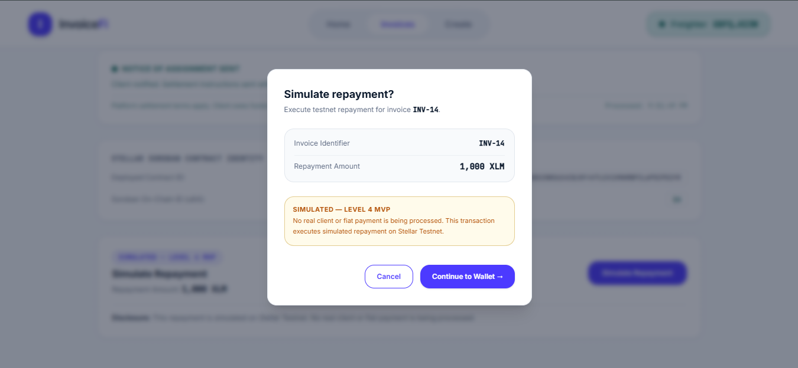
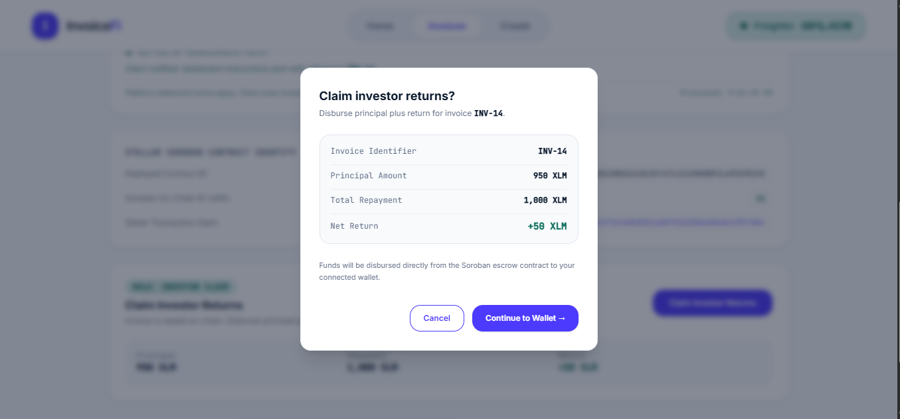
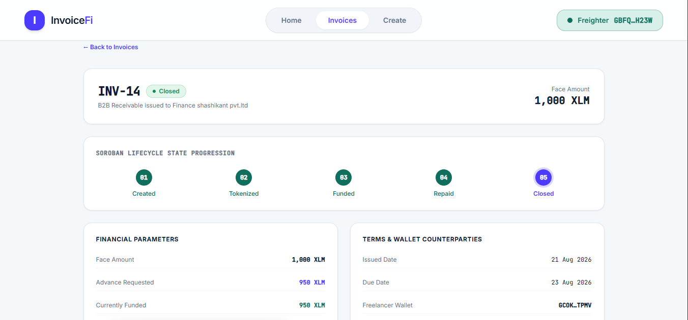
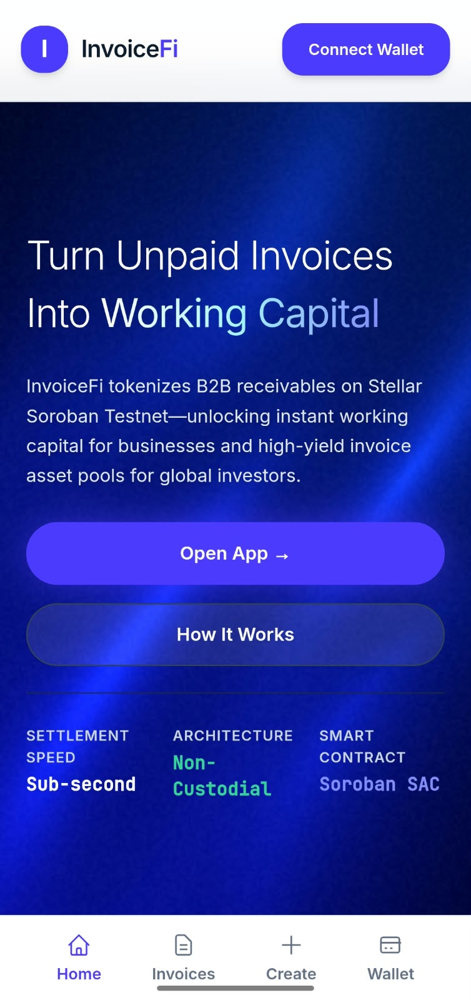

# InvoiceFi

**Turn Unpaid B2B Invoices Into Working Capital on Stellar & Soroban.**


---

## Live Demo

🚀 **Production Web Application**: [https://invoice-fi-five.vercel.app/](https://invoice-fi-five.vercel.app/)  
📂 **Official GitHub Repository**: [https://github.com/vanshdhiwar09/InvoiceFi](https://github.com/vanshdhiwar09/InvoiceFi)  
📝 **User Feedback Form**: [https://forms.gle/2mefPw72fh3enLcKA](https://forms.gle/2mefPw72fh3enLcKA)

---

## What is InvoiceFi?

**InvoiceFi** is a decentralized invoice financing protocol built on Stellar Testnet and Soroban smart contracts. It enables freelancers, agencies, and small-to-medium enterprises (SMEs) to tokenize unpaid B2B invoices into transparent on-chain assets and unlock early liquidity from investors.

### Value Proposition
- **For Freelancers & Businesses**: Instead of waiting 30, 60, or 90 days for client payment terms, invoice creators can sell or advance receivables to access immediate cash flow.
- **For Investors**: Investors provide capital to fund open invoices on-chain in exchange for a fixed, transparent yield upon invoice settlement.
- **On-Chain Enforcement**: Invoice lifecycle states, face values, advance rates, investor recording, and settlement payouts are managed autonomously by a Soroban smart contract.
- **Level 4 Scope**: Operates on Stellar Testnet with simulated repayment to demonstrate the full end-to-end invoice lifecycle without real-world fiat settlement.

---

## The Problem

Traditional B2B trade financing and invoice factoring face severe structural inefficiencies:

1. **Delayed Payment Terms**: Small businesses and freelancers routinely wait 30 to 90 days (`Net-30` / `Net-90`) to get paid by corporate clients, causing severe cash-flow squeezes.
2. **High Intermediary Fees**: Traditional factoring companies charge exorbitant rates (3%–10% per month) and require complex manual paperwork.
3. **Inaccessible to Small Ticket Sizes**: Micro-invoices ($500–$10,000) are regularly rejected by institutional factoring houses due to manual underwriting overhead.
4. **Lack of Transparency**: Off-chain factoring lacks real-time auditability, leading to double-factoring fraud and opaque settlement statuses.

---

## The Solution

InvoiceFi replaces opaque paper factoring with a **programmable, low-cost, sub-second settlement protocol on Stellar**.

```text
Create Invoice (Off-Chain Metadata + Document Storage)
              ↓
Tokenize Invoice (Soroban Smart Contract State)
              ↓
Fund Invoice (Investor Escrows Testnet Tokens via Wallet)
              ↓
Notice of Assignment (Event Ingestion Daemon + Queue Worker)
              ↓
Simulated Repayment (On-Chain Repayment Transition — Level 4 MVP)
              ↓
Claim Investor Returns (Investor Claims Principal + Yield)
              ↓
Closed State (Final On-Chain Settlement)
```

> **Note on Level 4 MVP Scope**: Repayment is simulated directly on-chain during Level 4 to validate the complete contract state machine without requiring live fiat bank integrations.

---

## Product Walkthrough

Here is the step-by-step user experience of InvoiceFi on Stellar Testnet:

### 1. Landing & Protocol Overview

*Public marketing hero introducing InvoiceFi's value proposition, protocol metrics, and how it works.*

### 2. Multi-Wallet Onboarding

*Unified wallet selection sheet supporting Freighter, Albedo, and xBull with network validation.*

### 3. Invoice Creation & Off-Chain Metadata Registration

*Creation form supporting financial parameter input, validation, and private PDF/image document upload.*

### 4. Soroban Invoice Tokenization

*On-chain tokenization on Soroban creating a transparent financial asset state on Stellar Testnet.*

### 5. Investor Wallet Funding

*Connected investor wallet advancing capital into Soroban escrow in exchange for yield.*

### 6. Notice of Assignment (NoA) Issuance

*Automated background ingestion daemon producing settlement reference instructions (e.g., `INV-14`) for the debtor.*

### 7. Simulated Repayment Execution

*Level 4 simulated on-chain repayment transitioning invoice status code from `Funded` (2) to `Repaid` (3).*

### 8. Claim Investor Returns

*Recorded investor executing `claim_returns` on Soroban to receive funded principal plus contractual return.*

### 9. Closed Invoice Lifecycle Completion

*Final `Closed` (4) state on Soroban contract, disabling further financial mutations.*

### 10. Dashboard & Lifecycle Analytics

*Real-time invoice dashboard filtering invoices by state (`Created`, `Tokenized`, `Funded`, `Repaid`, `Closed`).*

### 11. Mobile Responsive UI

*Responsive layout tested across desktop, tablet, and mobile (390px viewport).*

---

## Level 4 MVP Flow

The complete 10-step lifecycle implemented in InvoiceFi Level 4:

1. **Connect Wallet**: User connects a supported Stellar Testnet wallet (Freighter, Albedo, or xBull).
2. **Create Invoice**: Freelancer creates an invoice draft specifying face value, advance funding amount, due date, and client reference, uploading an invoice document.
3. **Tokenize Invoice**: Freelancer executes `tokenize_invoice` on Soroban, writing initial invoice state (`Created` → `Tokenized`) on-chain.
4. **Marketplace Listing**: Tokenized invoice appears on the public `/invoices` dashboard with status `Tokenized`.
5. **Investor Connection**: Investor connects a distinct wallet provider (e.g., Albedo or xBull).
6. **Fund Invoice**: Investor calls `invest` on Soroban. Testnet funds are escrowed into the contract, and the status transitions to `Funded`.
7. **Notice of Assignment Daemon**: Background event daemon ingests the `invoice_funded` Soroban event, inserts a queue record, and logs a Notice of Assignment memo (`INV-{id}`).
8. **Simulated Repayment**: User triggers `repay` on-chain. The Soroban contract verifies caller authorization, accepts repayment tokens, and updates status to `Repaid`.
9. **Claim Returns**: Recorded investor calls `claim_returns`. Soroban transfers face value funds to the investor and sets status to `Closed`.
10. **Lifecycle Closure**: Final state `Closed` prevents duplicate claims or state mutations.

> **Level 4 MVP Disclosure**: Level 4 uses simulated repayment to demonstrate the complete contract lifecycle without representing real-world fiat settlement.

---

## Supported Wallets

InvoiceFi features multi-wallet integration via standard Stellar wallet adapters:

- **Freighter**: Official browser extension wallet for Stellar and Soroban.
- **Albedo**: Web-based pop-up wallet adapter requiring zero installation.
- **xBull**: Multi-platform Stellar wallet extension.

### Wallet UX Protections
- **Network Mismatch Detection**: Automatically detects if a wallet is set to Mainnet or Public and alerts the user: `"Switch your wallet to Stellar Testnet to continue."`
- **Rejection & Error Handling**: Gracefully catches user cancellations and RPC submission failures, displaying actionable error alerts without freezing UI state.
- **Self-Funding Prevention**: Disables funding actions if the connected wallet address matches the invoice freelancer creator address.

---

## Architecture

InvoiceFi uses a decoupled three-tier architecture connecting Next.js, a Node.js/Supabase backend daemon, and Soroban smart contracts on Stellar Testnet.

```text
  [ User Browser / Client ]
             │
             ├─── (Stellar SDK / Wallet Kit) ───→ [ Stellar Testnet RPC ]
             │                                              │
             │                                   [ Soroban Contract ]
             │                                  (CCG2BPR7NEQPV4...2YR)
             │                                              │
             ├─── (HTTP / REST API)                        │ Emits Events
             ▼                                              ▼
  [ Vercel Frontend ]                           [ Event Ingestion Daemon ]
 (Next.js 16 App Router)                        (ENABLE_BACKGROUND_DAEMON)
             │                                              │
             └──────────────────┬───────────────────────────┘
                                ▼
                      [ Express / Node.js Backend ]
                                │
                        [ Supabase / Postgres ]
                        - Off-chain Metadata
                        - Notice of Assignment Queue
```

---

## On-Chain vs. Off-Chain Data

To ensure user privacy, regulatory compliance, and minimal gas fees, InvoiceFi segregates data between the public Stellar ledger and private off-chain storage:

| On-Chain (Soroban Contract State) | Off-Chain (Supabase & Documents) |
|---|---|
| Numeric On-Chain Invoice ID (`u64`) | Invoice display title & description |
| Freelancer Wallet Address (`Address`) | Debtor/Client name & contact details |
| Investor Wallet Address (`Option<Address>`) | Private invoice PDF/image documents |
| Face Value & Advance Funding Amount (`i128`) | Opaque `client_ref` hash mapping |
| Due Date Timestamp (`u64`) | Notice of Assignment delivery queue state |
| Lifecycle Status Code (`0`..`4`) | Event ingestion sync checkpoint |
| SAC Token Address (`Address`) | Application analytics metrics |

### Privacy & Security Rationale
Client identity, line items, and document uploads are stored in private Supabase buckets with Row-Level Security (RLS). Only a cryptographic hash (`client_ref`) is recorded on-chain, preventing public exposure of sensitive business relationships on the Stellar ledger.

---

## Notice of Assignment (NoA) Mechanism

The Notice of Assignment (NoA) is a fundamental legal and operational requirement in invoice financing: when an invoice is funded, the debtor must be notified to redirect final payment to the financing protocol rather than the original freelancer.

### Implementation Details
1. **Event Emission**: Upon confirmed funding, the Soroban contract emits a structured event: `("invoice_funded", invoice_id)`.
2. **Daemon Ingestion**: A Node.js background daemon polls Soroban RPC `getEvents`, filtering for contract event topics and maintaining a persistent sync checkpoint (`soroban_rpc_last_ledger`).
3. **Queue Processing**: Ingested events are inserted into `notice_assignment_queue` with state `DISCOVERED`. A worker claims items (`PROCESSING`) and logs the assignment notice (`PROCESSED`).
4. **Settlement Reference**: Every NoA generates an explicit settlement memo (e.g., `INV-14`) mapped exclusively to the numeric on-chain invoice ID.

> **Legal Disclosure**: The Notice of Assignment mechanism in this Level 4 MVP is an automated platform notification template and does NOT constitute a legally binding assignment of receivables under commercial law.

---

## Monitoring & Analytics

InvoiceFi integrates **Vercel Analytics** (`@vercel/analytics`) for real-time production application monitoring.

### Monitored Product Events
- `wallet_connected`: Provider type (`freighter`, `albedo`, `xbull`) and connection timestamp.
- `invoice_created`: Successful metadata registration and tokenization initialization.
- `invoice_funded`: Confirmed on-chain investor funding events.


*Vercel Analytics production dashboard monitoring real-time user sessions and protocol interactions.*

---

## Stellar / Soroban Deployment

- **Network**: Stellar Testnet (`Test SDF Network ; September 2015`)
- **Soroban Protocol Version**: Protocol 27
- **Stellar CLI Version**: `stellar 27.1.0`
- **WASM Hash**: `141adb115ef1827c091621be6fc8df9ca91de7c2daea9eca047238e88dbc147c`
- **Deployed Contract ID**: [`CCG2BPR7NEQPV4XOLABSZOWSU24CBJXF4V7LEXIXMAMBPIL6P5CPO2YR`](https://stellar.expert/explorer/testnet/contract/CCG2BPR7NEQPV4XOLABSZOWSU24CBJXF4V7LEXIXMAMBPIL6P5CPO2YR)
- **SAC XLM Token Contract ID**: `CDLZFC3SYJYDZT7K67VZ75HPJVIEUVNIXF47ZG2FB2RMQQVU2HHGCYSC`
- **Testnet Explorer**: [Inspect Deployed Contract on StellarExpert](https://stellar.expert/explorer/testnet/contract/CCG2BPR7NEQPV4XOLABSZOWSU24CBJXF4V7LEXIXMAMBPIL6P5CPO2YR)

---

## Security & MVP Limitations

InvoiceFi explicitly documents its Level 4 MVP scope boundaries:

1. **Testnet Environment**: Operates on Stellar Testnet using test XLM tokens; assets have zero monetary value.
2. **Simulated Repayment**: Repayment is simulated manually on-chain by calling `repay`. Real bank API/anchor settlement is planned for Level 6.
3. **Self-Attested Verification**: Invoice verification is self-attested by the creator in Level 4. Third-party risk scoring is planned for Level 6.
4. **Notice of Assignment Legal Status**: Platform NoAs are operational notices, not formal legal assignments.
5. **Single-Investor Funding**: Invoices are funded by a single investor in Level 4; fractional pooling is planned for Level 6.

---

## User Feedback & Iteration

We collected **12 feedback responses** from real Testnet users via our Google Form to guide iterative polish:

| Feedback Theme | User Observation | Action Taken in Level 4 | Status |
|---|---|---|---|
| **Explorer Verification** | Hard to find Stellar transaction hashes after funding | Added direct `View on explorer ↗` links to contract ID and tx hashes | Implemented ([Commit link to be added]) |
| **Pre-Wallet Onboarding** | Disconnected user felt lost on `/create` page | Added clear pre-wallet explanation card and instant `Connect Wallet` CTA | Implemented ([Commit link to be added]) |
| **Public Dashboard Explanation** | Unclear if testnet invoices required wallet connection | Added public Testnet explanation banner on `/invoices` header | Implemented ([Commit link to be added]) |
| **FAQ Scroll Length** | 14 FAQ items created excessive vertical scrolling on `/about` | Streamlined FAQ to 6 core items in a responsive 2-column grid | Implemented ([Commit link to be added]) |
| **Brand Identity** | Standard favicon looked plain in browser tabs | Added official InvoiceFi SVG brand mark favicon (`/icon.svg`) | Implemented ([Commit link to be added]) |

---

## Submission Evidence

- 🎥 **Level 4 Walkthrough Video**: [Watch Demo Video](PLACEHOLDER_DEMO_VIDEO_URL)
- 📊 **User Feedback Form**: [View Google Form](https://forms.gle/2mefPw72fh3enLcKA)
- 📈 **Feedback Data Export**: [Google Sheets Export](PLACEHOLDER_FEEDBACK_SHEET_URL)
- 🔗 **Wallet Interaction Proof**: [Stellar Expert Explorer](https://stellar.expert/explorer/testnet/contract/CCG2BPR7NEQPV4XOLABSZOWSU24CBJXF4V7LEXIXMAMBPIL6P5CPO2YR)
- 🖼️ **Screenshots & Media**: Available in `docs/screenshots/`
- 📑 **Pitch Deck**: [View Pitch Deck](PLACEHOLDER_PITCH_DECK_URL)

---

## RiseIn Level 4 Requirement Mapping

| RiseIn Level 4 Requirement | InvoiceFi Evidence | Status |
|---|---|---|
| **Public GitHub Repository** | [`vanshdhiwar09/InvoiceFi`](https://github.com/vanshdhiwar09/InvoiceFi) | ✅ Verified |
| **15+ Meaningful Commits** | 29 verified non-trivial git commits | ✅ Verified |
| **Live Web Deployment** | [`https://invoice-fi-five.vercel.app/`](https://invoice-fi-five.vercel.app/) | ✅ Verified |
| **Testnet Soroban Contract** | Deployed ID `CCG2BPR7NEQPV4XOLABSZOWSU24CBJXF4V7LEXIXMAMBPIL6P5CPO2YR` | ✅ Verified |
| **Multi-Wallet Support** | Freighter, Albedo, and xBull integrations | ✅ Verified |
| **Core Invoice Lifecycle** | Created → Tokenized → Funded → Repaid → Closed | ✅ Verified |
| **Mobile Responsive UI** | Tested across 390px, 768px, and 1440px viewports | ✅ Verified |
| **Loading & Error Handling** | Normalized wallet rejection, network mismatch, and RPC errors | ✅ Verified |
| **Notice of Assignment (NoA)** | RPC event ingestion daemon + queue worker (`INV-{id}`) | ✅ Verified |
| **Monitoring & Analytics** | Vercel Analytics tracking `wallet_connected`, `invoice_created`, `invoice_funded` | ✅ Verified |
| **User Feedback Collection** | 12 real user responses via Google Form | ✅ Verified |
| **10+ Real Wallet Interactions** | Real Testnet transactions recorded on Stellar Expert | ⏳ Evidence pending |
| **Demo Walkthrough Video** | Walkthrough recording | ⏳ Evidence pending |
| **Screenshots & Media** | 12 verified screenshots committed to `docs/screenshots/` | ✅ Verified |

---

## Demo Walkthrough Scenario

When recording or evaluating the live demo, follow this 11-step sequence:

1. **Landing**: Visit `https://invoice-fi-five.vercel.app/` and review protocol summary.
2. **Connect Wallet 1**: Click `Connect Wallet` and select **Freighter**.
3. **Create Invoice**: Navigate to `/create`, enter face value `1000 XLM`, funding advance `950 XLM`, upload document, and submit.
4. **Tokenize Invoice**: Click `Tokenize Invoice` on Soroban to record state on Stellar Testnet.
5. **Dashboard Listing**: View newly tokenized invoice on `/invoices`.
6. **Switch Wallet**: Disconnect wallet and connect **Albedo** (Investor wallet).
7. **Fund Invoice**: Open invoice detail `/invoices/[id]` and click `Fund Invoice Escrow`.
8. **NoA Event Ingestion**: Observe automatic Notice of Assignment banner generation (`INV-{id}`).
9. **Simulated Repayment**: Click `Simulate Repayment` to update contract status code to `Repaid`.
10. **Claim Returns**: Click `Claim Investor Returns` to transfer face value yield back to the investor.
11. **Explorer Verification**: Click `View on explorer ↗` to inspect transactions on StellarExpert.

---

## Local Development Setup

### Prerequisites
- Node.js `v20.x` or higher
- npm `v10.x` or higher
- Git

### 1. Clone Repository
```bash
git clone https://github.com/vanshdhiwar09/InvoiceFi.git
cd InvoiceFi
```

### 2. Frontend Setup
```bash
cd frontend
npm install
cp .env.example .env.local
npm run dev
```
Open [http://localhost:3000](http://localhost:3000) in your browser.

### 3. Backend Setup
```bash
cd ../backend
npm install
cp .env.example .env
npm start
```
Backend runs on [http://localhost:4005](http://localhost:4005).

---

## Testing & Quality Assurance

### Execute Automated Test Suites

```bash
# Run Backend Unit Tests (46/46 Passing)
cd backend
npm test

# Run Frontend Workflow & Wallet Tests (85/85 Passing)
cd frontend
npm test

# Run Frontend Linter (0 Errors / 0 Warnings)
npm run lint

# Run Production Turbopack Build
npm run build
```

---

## Project Roadmap

```text
Level 4 (Current) ──→ Level 5 (Next) ──→ Level 6 (Future) ──→ Level 7 (Target)
Testnet MVP         Marketplace &        Fractional &         Mainnet & Cross-Border
Simulated Repay     Portfolio Tools      Anchor Integration   Secondary Liquidity
```

### Level 4 — Current MVP (Completed)
- Single-investor funding on Stellar Testnet.
- Soroban contract lifecycle state machine.
- Event ingestion daemon & Notice of Assignment queue worker.
- Multi-wallet support (Freighter, Albedo, xBull).
- Vercel Analytics & 12 user feedback iterations.

### Level 5 — Marketplace & Portfolio (Planned)
- Public marketplace with filtering by yield, maturity, and risk score.
- Investor portfolio analytics & yield calculator.
- Expanded user base (50+ Testnet participants).

### Level 6 — Fractional Ownership & Mainnet Anchors (Planned)
- Fractional invoice funding across multiple investors.
- SEP-24 / SEP-31 anchor integration for real fiat bank settlement.
- Third-party invoice document verification & credit scoring.

### Level 7 — Secondary Market & Cross-Border Protocol (Planned)
- Secondary market trading of active invoice position tokens.
- Cross-border multi-currency settlement on Stellar Mainnet.
- Automated legal assignment generation & institutional custody.

---

## License

This project is submitted as an open-source entry for the **RiseIn Stellar Builder Program (Level 4)**. All smart contract code and application logic are provided for educational and evaluation purposes.
