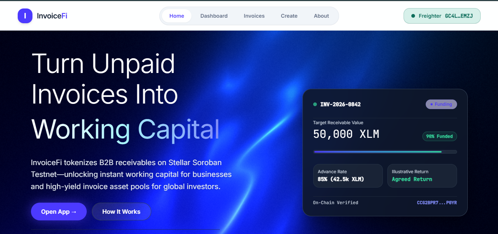
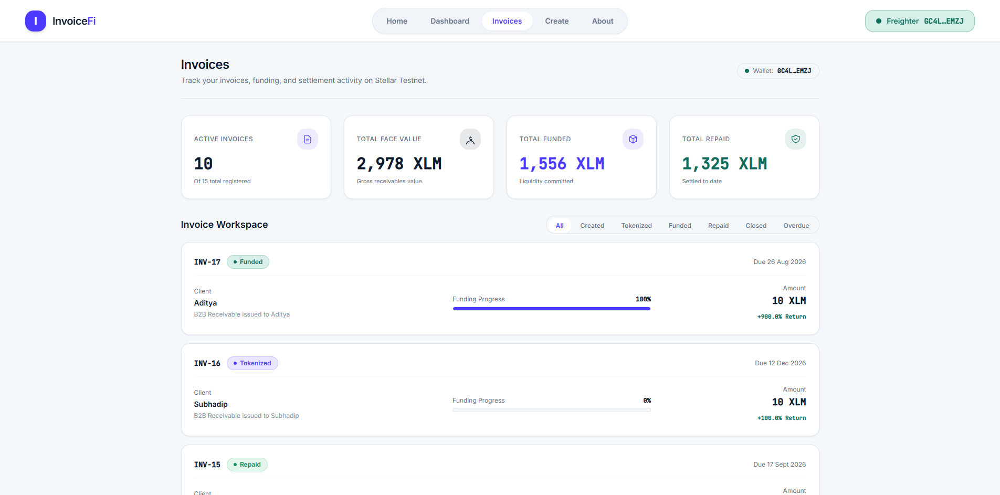
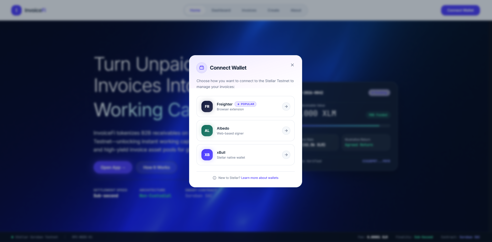
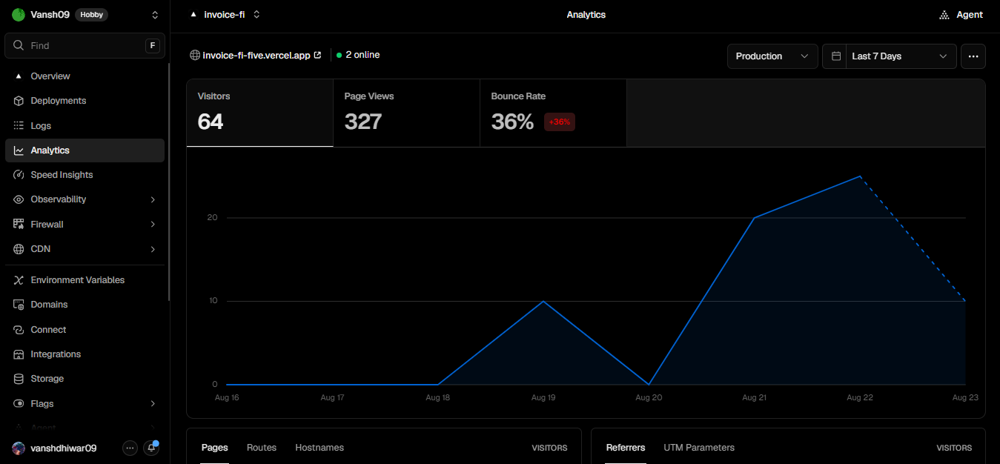
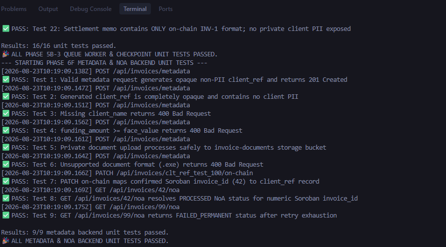
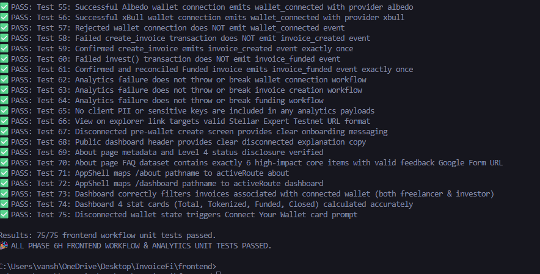
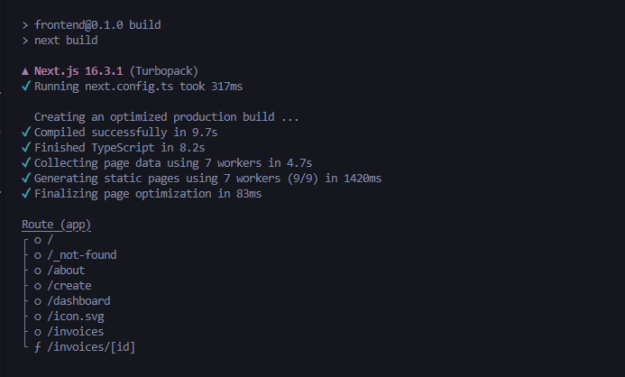

# InvoiceFi

**Turn Unpaid B2B Invoices Into Working Capital on Stellar & Soroban.**


---

## Live Demo

- **Live Application**: [https://invoice-fi-five.vercel.app/](https://invoice-fi-five.vercel.app/)
- **GitHub Repository**: [GitHub Repository](PLACEHOLDER_GITHUB_URL)
- **Soroban Contract ID**: `CCG2BPR7NEQPV4XOLABSZOWSU24CBJXF4V7LEXIXMAMBPIL6P5CPO2YR`
- **StellarExpert Testnet Contract Explorer**: [View Contract on StellarExpert](https://stellar.expert/explorer/testnet/contract/CCG2BPR7NEQPV4XOLABSZOWSU24CBJXF4V7LEXIXMAMBPIL6P5CPO2YR)

---

## What InvoiceFi Does

### Problem
Businesses and freelancers complete work today but wait 30–90 days for invoice payment, creating a critical working-capital gap.

### Solution
InvoiceFi represents unpaid B2B invoices on-chain through a Soroban smart contract and demonstrates a financing lifecycle where an investor can fund the invoice before final repayment.

### Financing Lifecycle
`Create` → `Tokenize` → `Fund` → `Notice of Assignment` → `Simulated Repayment` → `Claim Returns` → `Closed`

> **Note**: Level 4 uses simulated repayment on Stellar Testnet. No real-world fiat repayment is represented.

---

## How It Works

1. Freelancer/business connects a Stellar wallet.
2. Creates an invoice and provides self-attested invoice information.
3. Invoice is tokenized through the Soroban contract.
4. A single investor funds the invoice on Stellar Testnet.
5. Funding triggers the Notice of Assignment (NoA) workflow.
6. Repayment is simulated for the Level 4 Testnet MVP.
7. Investor claims the recorded return on-chain.
8. Invoice reaches Closed state.

**Supported Wallets**: Freighter · Albedo · xBull  
*Wallet rejection and Testnet network mismatch states are handled explicitly.*

---

## Product & Testing Screenshots

### Home


### Dashboard


### Invoices


### Wallet Options


### Mobile Responsive


### Production Analytics


### Backend Test Suite


### Frontend Unit Tests


### Linter & Production Build


### CI/CD Automated Pipeline


---

## Monitoring & Analytics

InvoiceFi uses Vercel Analytics for lightweight production monitoring and usage analytics.

**Tracked Events**:
- Wallet Connections (`wallet_connected`)
- Invoice Creation (`invoice_created`)
- Invoice Funding (`invoice_funded`)

---

## User Feedback

12 users tested the Level 4 application through the feedback form.

**Key Feedback Takeaways**:
- Core financing flow was generally clear and usable.
- Users valued the transparent wallet-based Testnet experience.
- Minor clarity and onboarding improvements were identified.
- Direct explorer links and clearer disconnected wallet states were added based on feedback.

- **Feedback Form**: [Google Feedback Form](https://forms.gle/2mefPw72fh3enLcKA)
- **Feedback Responses**: [Exported Feedback Sheet](PLACEHOLDER_FEEDBACK_SHEET_URL)

---

## Level 4 Evidence

Level 4 evidence includes the live Testnet deployment, 10+ real wallet interactions, multi-wallet testing, mobile-responsive product UI, Vercel Analytics monitoring, Notice of Assignment workflow, user feedback, and a complete demo walkthrough.

- **Demo Video**: [Watch Walkthrough Video](PLACEHOLDER_DEMO_VIDEO_URL)
- **Wallet Interaction Evidence**: [View Wallet Evidence](PLACEHOLDER_WALLET_EVIDENCE_URL)
- **Feedback Sheet**: [View Feedback Sheet](PLACEHOLDER_FEEDBACK_SHEET_URL)

---

## Architecture

InvoiceFi uses a decoupled three-tier architecture connecting Next.js, a Node.js/Supabase backend daemon, and Soroban smart contracts on Stellar Testnet.

```text
User → InvoiceFi Next.js Frontend → Wallet / Soroban RPC → Soroban Contract → Stellar Testnet

Frontend → Node/Express Backend → Supabase → NoA Event Processing
```

- **Frontend**: Next.js / React / TypeScript
- **Backend**: Node.js / Express / Supabase
- **Blockchain**: Stellar Soroban / Testnet

---

## Limitations

- **Stellar Testnet Only**: Operates strictly on Stellar Testnet using test XLM.
- **Simulated Repayment**: Repayment is simulated for the Level 4 Testnet MVP.
- **Self-Attested Invoices**: Invoice verification is self-attested without third-party credit scoring.
- **No Real Fiat Settlement**: Fiat bank settlement is not integrated in Level 4.
- **Single Investor Funding**: Full single-investor invoice funding per contract instance.
- **Platform NoA Notice**: Notice of Assignment is a platform/MVP mechanism and not a legally binding receivable transfer.

---

## Local Development

### Frontend
```bash
cd frontend
npm install
npm run dev
```

### Backend
```bash
cd backend
npm install
npm run dev
```

*See `.env.example` in `frontend/` and `backend/` for required environment variables.*

---

## Testing

Verified execution test results:

- **Frontend Tests**: 89 / 89 PASSED
- **Backend Tests**: 46 / 46 PASSED
- **ESLint**: 0 errors / 0 warnings
- **Production Build**: Successful

---

## Demo

Watch the full Level 4 walkthrough.

[Watch Demo Video](PLACEHOLDER_DEMO_VIDEO_URL)

---

## Feedback / Contact

- **Feedback Form**: [https://forms.gle/2mefPw72fh3enLcKA](https://forms.gle/2mefPw72fh3enLcKA)
- **GitHub Repository**: [GitHub Repository](PLACEHOLDER_GITHUB_URL)

---

**Built on Stellar · Soroban · Testnet**

*InvoiceFi — Turn unpaid invoices into working capital.*
