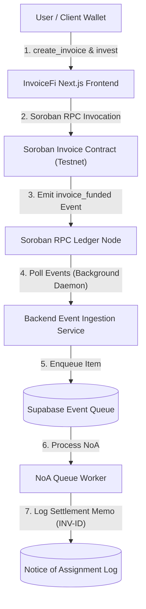
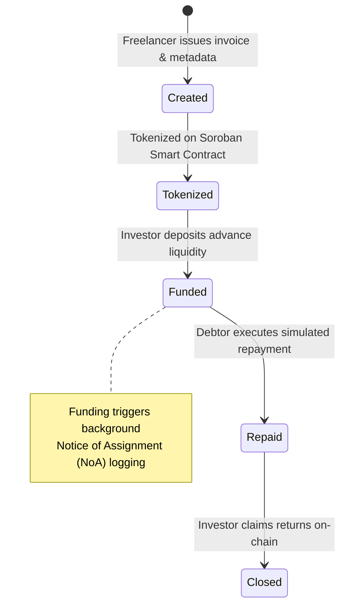
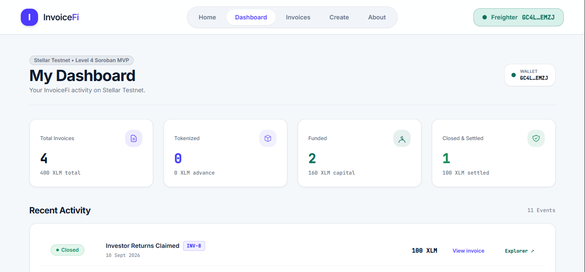

# 🧾 InvoiceFi — Decentralized Invoice Financing Protocol

[](https://github.com/vanshdhiwar09/InvoiceFi/actions/workflows/ci.yml)
[](https://stellar.org)
[](https://soroban.stellar.org)
[](https://nextjs.org/)
[](https://www.typescriptlang.org/)
[](https://www.rust-lang.org/)
[](https://nodejs.org/)
[](https://supabase.com/)
[](https://opensource.org/licenses/MIT)
[](https://www.risein.com/)

**Turn Unpaid B2B Invoices Into Working Capital on Stellar & Soroban.**

InvoiceFi is a decentralized invoice financing protocol built on Stellar and Soroban smart contracts. It enables freelancers, agencies, and SMBs to tokenize unpaid B2B receivables into liquid digital assets, allowing investors to fund them upfront on Stellar Testnet and execute a complete financing lifecycle—from tokenization and funding to Notice of Assignment (NoA) logging, repayment, and investor return claims.

---

## 📌 Why InvoiceFi?

- ⚡ **Instant Working Capital**: Eliminates 30–90 day payment waits by discounting and tokenizing receivables upfront.
- 🔒 **Trustless Soroban Escrow**: Funds and invoice lifecycle states are locked inside WASM smart contracts, avoiding third-party custody risks.
- 📋 **Automated Notice of Assignment (NoA)**: Asynchronous background worker processes on-chain funding events and logs non-PII settlement references (`INV-{onChainId}`).
- 👛 **Multi-Wallet Abstraction**: Native browser wallet integration supporting Freighter, Albedo, and xBull wallets.
- 📱 **Mobile-First CAD Design**: Responsive workspace with adaptive mobile navigation docks, status pills, and tabular activity layouts formatted down to 320px viewports.

---

## 🚀 Live Demo

- **Live Application**: [https://invoice-fi-five.vercel.app](https://invoice-fi-five.vercel.app)
- **GitHub Repository**: [https://github.com/vanshdhiwar09/InvoiceFi](https://github.com/vanshdhiwar09/InvoiceFi)
- **Demo Video Walkthrough**: [Watch Full Level 4 Walkthrough](https://drive.google.com/file/d/1kylGWaTJL3s9p4uy1JvJOOYAR4XhRfaR/view?usp=sharing)

### Stellar Expert Testnet Contract Explorer
- 📄 [Invoice Soroban Contract Explorer](https://stellar.expert/explorer/testnet/contract/CCG2BPR7NEQPV4XOLABSZOWSU24CBJXF4V7LEXIXMAMBPIL6P5CPO2YR)
- 💸 [Wrapped XLM SAC Token Explorer](https://stellar.expert/explorer/testnet/contract/CDLZFC3SYJYDZT7K67VZ75HPJVIEUVNIXF47ZG2FB2RMQQVU2HHGCYSC)

Every transaction and contract invocation in InvoiceFi generates a direct StellarExpert Testnet link using this standard format:
```text
https://stellar.expert/explorer/testnet/contract/CCG2BPR7NEQPV4XOLABSZOWSU24CBJXF4V7LEXIXMAMBPIL6P5CPO2YR
```

---

## 📖 Table of Contents

1. [⚡ Features](#-features)
2. [🛠 Tech Stack](#-tech-stack)
3. [🏗 System Architecture](#-system-architecture)
4. [🚦 Invoice Lifecycle](#-invoice-lifecycle)
5. [📸 Screenshots](#-screenshots)
6. [💬 User Feedback & Level 4 Evidence](#-user-feedback--level-4-evidence)
7. [📦 Folder Structure](#-folder-structure)
8. [📖 Smart Contracts](#-smart-contracts)
9. [⚙ Installation & Setup](#-installation--setup)
10. [🧪 Testing](#-testing)
11. [🚀 Deployment](#-deployment)
12. [🔒 Security & Permission Model](#-security--permission-model)
13. [⚠️ Known Limitations](#-known-limitations)
14. [🔮 Future Roadmap](#-future-roadmap)
15. [📄 License & Contact](#-license--contact)

---

## ⚡ Features

- **Multi-Wallet Connectivity**: Connect via Freighter, Albedo, or xBull with automatic Testnet network detection and rejection handling.
- **Invoice Creation & Metadata Generation**: Issue B2B invoices with client references, face value, advance funding target, and PDF/image documentation.
- **Soroban WASM Tokenization**: Register self-attested invoices on-chain with deterministic `u64` invoice IDs.
- **Single-Investor Funding**: Escrow funding execution via Stellar Asset Contract (SAC) token transfers.
- **Notice of Assignment (NoA) Daemon**: Background RPC ingestion queue worker that logs settlement memos without exposing client PII.
- **Simulated Repayment & Investor Returns Claim**: Execute Testnet repayments (`repay`) and claim accumulated investor returns (`claim_returns`) on-chain.
- **Level 4 Basic Wallet Activity Dashboard (`/dashboard`)**: Personal activity overview featuring top 4 stat cards with SVG icon badges, structured timeline items, and invoice cards.
- **Production Analytics**: Lightweight event tracking powered by Vercel Analytics (`wallet_connected`, `invoice_created`, `invoice_funded`).

---

## 🛠 Tech Stack

| Layer | Technology | Purpose |
|---|---|---|
| **Frontend** | Next.js 16.3 (App Router), React, TS | Modern responsive UI, AppShell navigation, and client state management. |
| **Styling** | Vanilla CSS, Tailwind CSS | Custom design system tokens (`#4C3AFF`, `#141A3D`, `#0D1B2E`, `#0F6E5C`), cards, and pills. |
| **Wallets** | Stellar Wallets Kit, Freighter | Multi-wallet abstraction, transaction signing, and network validation. |
| **Blockchain** | Soroban Rust SDK, Soroban RPC | On-chain contract storage, event ingestion, and RPC status reconciliation. |
| **Contracts** | Rust 1.84+, WASM | Soroban smart contract managing 5 lifecycle states and authorization. |
| **Backend API** | Node.js, Express, TS | Metadata registration, non-PII `client_ref` generation, and NoA status endpoints. |
| **Database** | Supabase (PostgreSQL) | Off-chain invoice metadata indexing and NoA event queue storage. |
| **Analytics** | Vercel Analytics | Production usage analytics and event telemetry. |
| **Deployment**| Vercel & Render | Continuous deployment pipeline for web frontend and backend Express server. |

---

## 🏗 System Architecture

InvoiceFi uses a decoupled three-tier architecture connecting the Next.js web application, a Node.js/Supabase backend event daemon, and Soroban smart contracts on Stellar Testnet.



---

## 🚦 Invoice Lifecycle

Each invoice transitions through 5 explicit on-chain status codes managed by the Soroban smart contract:



---

## 📸 Screenshots

#### 💻 Desktop Home Page


#### 📊 Level 4 Wallet Activity Dashboard (`/dashboard`)


#### 📋 Invoices Workspace (`/invoices`)


#### 👛 Wallet Connection Options


#### 📱 Mobile Responsive View


#### 📈 Vercel Production Analytics


#### 🧪 Backend Test Suite Verification (46/46 Passed)


#### 🧪 Frontend Unit Test Suite Verification (89/89 Passed)


#### 🏗 Linter & Next.js Production Turbopack Build Verification


#### 🔄 CI/CD Automated Pipeline


---

## 💬 User Feedback & Level 4 Evidence

### User Feedback Summary (12 Testers)
InvoiceFi underwent testing by 12 distinct users through our structured feedback form.

- **Key Takeaways**:
  - 🟢 **Usability**: Core invoice creation and funding flows were intuitive and clear.
  - 🟢 **Transparency**: Testers appreciated direct StellarExpert transaction links and explicit status pills.
  - 🟡 **Feedback Driven Improvements**: Added explorer links, clearer disconnected wallet state cards, and top stat card SVG icons based directly on user feedback.

- **Feedback Form**: [Google Feedback Form](https://forms.gle/2mefPw72fh3enLcKA)
- **Exported Feedback Sheet**: [View Feedback Responses Sheet](https://docs.google.com/spreadsheets/d/1bK_b4M2r1nQrEeGTPlTGFuL1pp_C1euft2HRhhhiph0/edit?usp=sharing)

### Level 4 Requirements Evidence
- **Public GitHub Repository**: [https://github.com/vanshdhiwar09/InvoiceFi](https://github.com/vanshdhiwar09/InvoiceFi)
- **Git Activity**: **31 verified meaningful commits** on main repository branch.
- **Live Demo Deployment**: [https://invoice-fi-five.vercel.app/](https://invoice-fi-five.vercel.app/)
- **Soroban Contract Address**: `CCG2BPR7NEQPV4XOLABSZOWSU24CBJXF4V7LEXIXMAMBPIL6P5CPO2YR`
- **Wallet Interaction Evidence**: [10+ Wallet Interactions Evidence](PLACEHOLDER_WALLET_EVIDENCE_URL)
- **Demo Video Walkthrough**: [Watch Walkthrough Video](https://drive.google.com/file/d/1kylGWaTJL3s9p4uy1JvJOOYAR4XhRfaR/view?usp=sharing)

---

## 📦 Folder Structure

The InvoiceFi repository is structured as a clean monorepo:

```text
InvoiceFi/
├── contracts/                  # Soroban Rust smart contract workspace
│   ├── invoice_contract/       # Smart contract managing 5-state invoice lifecycle
│   │   ├── src/lib.rs          # Soroban contract logic, auth & state storage
│   │   └── Cargo.toml
├── frontend/                   # Next.js 16.3 web application
│   ├── src/app/                # App router routes (/, /dashboard, /invoices, /create, /about)
│   ├── src/components/         # Reusable UI components (AppShell, Card, StatusPill, WalletSheet)
│   ├── src/lib/invoices/       # Invoice service, Soroban RPC client, and analytics
│   └── src/lib/wallet/         # Stellar Wallets Kit adapter & context provider
├── backend/                    # Node.js Express & Supabase event daemon
│   ├── src/events/             # Event ingestion, normalizer, and NoA queue worker
│   ├── src/routes/             # Metadata REST API endpoints
│   └── tests/                  # Backend unit test suites (46 tests)
└── docs/                       # Verification screenshots and architecture docs
    └── screenshots/            # UI, testing, and CI/CD verification images
```

---

## 📖 Smart Contracts

The `invoice_contract` manages invoice tokenization, advance funding, simulated repayment, and return claims.

| Function | Authority | Description |
|---|---|---|
| `initialize` | Contract Admin | Initializes contract parameters and admin control. |
| `create_invoice` | Freelancer | Registers a new tokenized invoice with face value and advance amount. |
| `invest` | Investor | Deposits advance liquidity via SAC token transfer and updates status to `Funded`. |
| `repay` | Debtor / Client | Executes simulated invoice repayment, updating status to `Repaid`. |
| `claim_returns` | Investor | Transfers repayment funds to investor and updates status to `Closed`. |
| `get_invoice` | Public | Returns complete on-chain invoice data struct and status code. |

---

## ⚙ Installation & Setup

### Prerequisites
- Node.js `v20.x` or higher
- Rust `v1.84.0+` with `wasm32-unknown-unknown` target
- Stellar CLI installed locally

### Step-by-Step Setup

1. **Clone the Repository**:
   ```bash
   git clone https://github.com/vanshdhiwar09/InvoiceFi.git
   cd InvoiceFi
   ```

2. **Frontend Setup**:
   ```bash
   cd frontend
   npm install
   cp .env.example .env.local
   npm run dev
   ```

3. **Backend Setup**:
   ```bash
   cd ../backend
   npm install
   cp .env.example .env
   npm run dev
   ```

---

## 🧪 Testing

InvoiceFi includes complete automated test coverage across both frontend and backend modules:

```bash
# Run Backend Unit Tests (46 tests)
cd backend && npm test

# Run Frontend Unit Tests (89 tests)
cd frontend && npm test

# Run Frontend Linter (0 errors / 0 warnings)
cd frontend && npm run lint

# Run Next.js Production Turbopack Build Verification (9 routes static compiled)
cd frontend && npm run build
```

---

## 🚀 Deployment

- **Frontend Hosting**: Vercel (`https://invoice-fi-five.vercel.app/`)
- **Backend Service**: Render Express API Node.js server
- **Stellar Soroban Contract**: Deployed on Stellar Testnet (`CCG2BPR7NEQPV4XOLABSZOWSU24CBJXF4V7LEXIXMAMBPIL6P5CPO2YR`)

---

## 🔒 Security & Permission Model

- **Soroban `require_auth()` Checks**: Strict cryptographic authorization enforcing that only recorded freelancers can create/tokenize and only recorded investors can claim returns.
- **Non-PII Reference Masking**: Opaque `client_ref` strings eliminate client PII from public ledger records.
- **Stellar Asset Contract (SAC) Safety**: Asset transfers execute through tested SAC contract interfaces.

---

## ⚠️ Known Limitations

- **Stellar Testnet Only**: Operates strictly on Stellar Testnet using test XLM.
- **Simulated Repayment**: Repayment is simulated for the Level 4 Testnet MVP.
- **Self-Attested Invoices**: Invoice details are self-attested without third-party credit bureau verification.
- **Single Investor Escrow**: Single investor funding per contract instance in Level 4.
- **Platform NoA Notice**: Notice of Assignment is an automated platform/MVP mechanism and not a legally binding receivable assignment.

---

## 🔮 Future Roadmap

- **Level 5**: Investor portfolio management, APY yield calculators, and secondary invoice marketplace.
- **Level 6**: Fractional multi-investor liquidity pooling and automated credit risk scoring.
- **Level 7**: Fiat banking gateway (Stellar Anchor / SEP-24) and legally binding e-signature assignment enforcement.

---

## 📄 License & Contact

Distributed under the **MIT License**. See `LICENSE` for details.

- **Feedback Form**: [https://forms.gle/2mefPw72fh3enLcKA](https://forms.gle/2mefPw72fh3enLcKA)
- **GitHub Repository**: [https://github.com/vanshdhiwar09/InvoiceFi](https://github.com/vanshdhiwar09/InvoiceFi)

---

**Built on Stellar · Soroban · Testnet**

*InvoiceFi — Turn unpaid invoices into working capital.*
