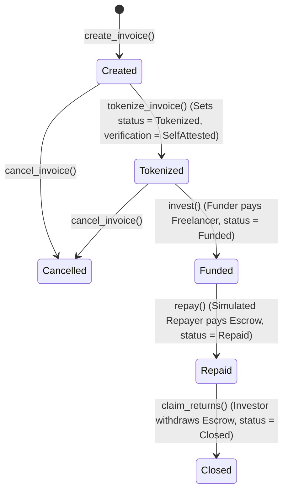

# FINAL IMPLEMENTATION PLAN — INVOICEFI LEVEL 4 MVP

This document outlines the final, implementation-ready Level 4 Testnet architecture for the Level 4 MVP of the InvoiceFi decentralized invoice-financing platform on Stellar/Soroban Testnet.

---

## 1. Architecture & Boundaries

```text
                    ┌─────────────────────┐
                    │      Frontend       │
                    │ Next.js + SWK       │
                    └──────────┬──────────┘
                               │
                    wallet-signed tx
                               │
                               ▼
                    ┌─────────────────────┐
                    │   Invoice Contract  │
                    │      Soroban        │
                    ├─────────────────────┤
                    │ Invoice Registry    │
                    │ State Machine       │
                    │ Funding State       │
                    │ Repayment State     │
                    │ Investor            │
                    │ Token/Asset         │
                    └──────────┬──────────┘
                               │
                         Contract Events
                               │
                               ▼
                    ┌─────────────────────┐
                    │ Backend / Supabase  │
                    ├─────────────────────┤
                    │ Private metadata    │
                    │ Client email        │
                    │ Documents           │
                    │ Notifications       │
                    │ Analytics           │
                    │ Event history       │
                    └─────────────────────┘
```

The system establishes a clean separation between public on-chain states and private off-chain metadata:

- **On-chain (Authoritative source of truth for financial & lifecycle states)**:
  - Invoice ID (Registry-based `u64` counter)
  - Addresses (Freelancer, Investor)
  - Financial values (Face Value, Funding Amount, Repayment Amount)
  - Business Due Date (Timestamp)
  - Ledger Stablecoin token contract address (e.g. Testnet USDC)
  - Lifecycle state (Created, Tokenized, Funded, Repaid, Closed, Cancelled)
  - Verification state (None, SelfAttested, Verified)
  - Non-PII client reference (`client_ref` UUID)

- **Off-chain (Supabase PostgreSQL database)**:
  - Client details (Email, Name, Organization)
  - Invoice description and uploaded PDF documents
  - Notification logs (Notice of Assignment status)
  - Event ingestion syncing status (`sync_state` and `notice_assignment_queue`)
  - Off-chain analytics (clicks, wallet connections)

---

## 2. Contract Data Model

The registry contract implements the following schema:

```rust
#[derive(Clone, Debug, Eq, PartialEq)]
#[contracttype]
pub enum InvoiceStatus {
    Created = 0,
    Tokenized = 1,
    Funded = 2,
    Repaid = 3,
    Closed = 4,
    Cancelled = 5,
}

#[derive(Clone, Debug, Eq, PartialEq)]
#[contracttype]
pub enum VerificationStatus {
    None = 0,
    SelfAttested = 1,
    Verified = 2,
}

#[derive(Clone, Debug, Eq, PartialEq)]
#[contracttype]
pub struct Invoice {
    pub id: u64,
    pub freelancer: Address,
    pub client_ref: String,       // Opaque external non-PII ID generated by the backend (e.g. clt_7f3a...)
    pub token_address: Address,   // Stablecoin token address
    pub face_value: i128,         // e.g. 1000 * 10^7
    pub funding_amount: i128,     // e.g. 950 * 10^7
    pub repayment_amount: i128,   // e.g. 1000 * 10^7 (enforced: repayment_amount == face_value)
    pub due_date: u64,            // Business due date (timestamp)
    pub status: InvoiceStatus,
    pub verification: VerificationStatus,
    pub investor: Option<Address>,
}

#[derive(Clone)]
#[contracttype]
pub enum DataKey {
    InvoiceCounter,
    Invoice(u64),
}
```

---

## 3. Storage Strategy

- **Contract Configuration & Metadata**: Stored in `Instance` storage (e.g., `InvoiceCounter`). Instance storage is loaded automatically with the contract. Its TTL is maintained and bumped alongside the contract instance usage.
- **Invoice Records**: Stored in `Persistent` storage:
  ```rust
  env.storage().persistent().set(&DataKey::Invoice(invoice_id), &invoice);
  ```
  This isolates invoice entries from general contract instance state, preserving space and allowing specific lifecycle extensions.

---

## 4. TTL Strategy

To accommodate typical 60–90 day invoice lifecycles under Soroban's state archival rules, we implement a two-layer TTL strategy.

### 1. Ledger Calculations (at 5-second close times)
Stellar's testnet/network parameters define minimum and maximum TTL thresholds for Persistent and Instance storage:
- **TTL Minimum/Threshold**: `2,073,600 ledgers` (approx. 120 days minimum)
- **TTL Maximum/Limit**: `3,110,400 ledgers` (approx. 180 days maximum)

### 2. Operational Strategies
- **Pure Read Helpers**: `get_invoice()` and `get_invoice_count()` are pure read helpers. They MUST NOT call `extend_ttl()` or mutate storage in any way.
- **State-Changing Function TTL Maintenance**: Business and state-changing contract functions may maintain TTL as part of their normal persistent storage access:
  - `create_invoice`
  - `tokenize_invoice`
  - `invest`
  - `repay`
  - `claim_returns`
  - `cancel_invoice`
- **Instance Storage Bumping**: The contract automatically extends the contract instance and counter storage TTLs whenever an invoice is created, ensuring the registry configuration does not expire independently of active contract use:
  ```rust
  env.storage().instance().extend_ttl(2_073_600, 3_110_400);
  ```
- **Durable Maintenance Entry Point (`extend_invoice_ttl`)**:
  - The contract exposes an explicit public `extend_invoice_ttl(env, invoice_id)` function that anyone can call to extend the persistent storage TTL of a specific invoice.
  - **Safety constraint**: This is a maintenance operation. It purely calls `extend_ttl` on the requested `DataKey::Invoice(invoice_id)` persistent storage key and must **NOT** modify any invoice business fields (it does not modify status, ownership, due date, amounts, or any other business data).
  - It validates that the invoice exists before executing:
    ```rust
    let key = DataKey::Invoice(invoice_id);
    if env.storage().persistent().has(&key) {
        env.storage().persistent().extend_ttl(&key, 2_073_600, 3_110_400);
    } else {
        panic!("Invoice does not exist");
    }
    ```
- **Backend Keeper (Off-chain)**: The backend keeper runs a periodic task (every 7 days) that queries active, non-closed invoices from the database, checks their ledger TTL via Soroban RPC, and invokes `extend_invoice_ttl()` when required if the TTL drops below the threshold.
- **Archival Recovery (Host-level Restoration)**:
  If the backend keeper is offline and the invoice sits inactive for >180 days, it is archived by the network.
  Archival recovery does not run inside the contract. Instead, it follows standard Host-level Soroban mechanics:
  ```text
  Archived Persistent Invoice
          ↓
  Client/backend attempts normal transaction simulation
          ↓
  RPC identifies archived entry / restoration requirement
          ↓
  Build transaction with restoration footprint (incorporating key in restore list)
          ↓
  Submit transaction
          ↓
  Entry restored & Normal contract operation executes
  ```
  Starting in Protocol 23, archived entries included in the restore list during a normal `InvokeHostFunctionOp` are automatically restored before execution, meaning no separate `RestoreFootprintOp` is required for Level 4.

---

## 5. State Machine



---

## 6. Authorization Matrix

The contract uses Soroban's standard `Address::require_auth()` signature verification, which automatically binds the caller's signature to the contract address, function name, and all parameters (including ID, amounts, and addresses) to guarantee financial safety.

Every function that interacts with `invoice_id` must validate that the invoice exists on-chain; otherwise it immediately panics with `"Invoice does not exist"`.

| Function | Required Caller | Auth Call | State Precondition | State Postcondition |
|---|---|---|---|---|
| `create_invoice()` | Freelancer | `freelancer.require_auth()` | None | `Created` (Verification: `None`) |
| `tokenize_invoice()` | Freelancer | `freelancer.require_auth()` | `Created` (Requires existence) | `Tokenized` (Verification: `SelfAttested`) |
| `cancel_invoice()` | Freelancer | `freelancer.require_auth()` | `Created` or `Tokenized` (Requires existence) | `Cancelled` |
| `invest()` | Investor | `investor.require_auth()` | `Tokenized` (Requires existence) | `Funded` |
| `repay()` | Simulated Repayer | `repayer.require_auth()` | `Funded` (Requires existence) | `Repaid` |
| `claim_returns()` | Recorded Investor | `invoice.investor.unwrap().require_auth()` | `Repaid` (Requires existence) | `Closed` |
| `extend_invoice_ttl()`| Anyone | None | Any (Requires existence) | TTL Bumped |

---

## 7. Token / Payment Flow

Stablecoin transfers are handled by invoking the standard token client (`soroban_sdk::token::Client`).

### Phase A: Funding
Investor transfers `funding_amount` directly to the Freelancer. The contract acts as the state transition coordinator.
- **Code**:
  ```rust
  let token = token::Client::new(&env, &invoice.token_address);
  token.transfer(&investor, &invoice.freelancer, &invoice.funding_amount);
  ```
- **Fails if**: Investor has insufficient balance or rejects the wallet signing request.

### Phase B: Simulated Repayment
The Simulated Repayer deposits the full `repayment_amount` ($1,000) into the smart contract's escrow address.
- **Code**:
  ```rust
  let token = token::Client::new(&env, &invoice.token_address);
  token.transfer(&repayer, &env.current_contract_address(), &invoice.repayment_amount);
  ```
- **Fails if**: Repayer has insufficient balance, or invoice is not in `Funded` state.

### Phase C: Investor Returns Claim
The recorded Investor claims the payout from the contract escrow.
- **Code**:
  ```rust
  let token = token::Client::new(&env, &invoice.token_address);
  token.transfer(&env.current_contract_address(), &investor, &invoice.repayment_amount);
  ```
- **Fails if**: Caller is not the recorded investor, or invoice is not in `Repaid` state. Idempotence is guaranteed by checking the state transition (only `Repaid` can be claimed, transitioning to `Closed`).

---

## 8. Financial Invariants

The contract strictly enforces these validation rules during `create_invoice()`:
- `face_value > 0`
- `funding_amount > 0`
- `funding_amount < face_value`
- `repayment_amount == face_value`
- `due_date > env.ledger().timestamp()` (must be in the future)
- `due_date < env.ledger().timestamp() + 31_536_000` (capped to maximum 1 year to avoid overflow issues)

---

## 9. Event Model

When an invoice is funded, the contract emits a rich event containing the transaction details:
- **Event Topic**: `("invoice_funded", invoice_id)`
- **Event Payload**: `(freelancer, investor, funding_amount, token_address)`
- **Soroban Code**:
  ```rust
  env.events().publish(
      (Symbol::new(&env, "invoice_funded"), invoice_id),
      (
          invoice.freelancer.clone(),
          invoice.investor.clone().unwrap(),
          invoice.funding_amount,
          invoice.token_address.clone()
      )
  );
  ```

---

## 10. Backend / Supabase Architecture

The backend daemon monitors the RPC event stream and processes client notifications.

### Event Processing Queue Schema
```sql
CREATE TYPE event_status AS ENUM ('DISCOVERED', 'PROCESSING', 'PROCESSED', 'FAILED', 'FAILED_PERMANENT');

CREATE TABLE sync_state (
    key VARCHAR(255) PRIMARY KEY,
    value BIGINT NOT NULL
);

CREATE TABLE notice_assignment_queue (
    event_id VARCHAR(255) PRIMARY KEY, -- Deduplication key (rpc event ID)
    invoice_id BIGINT NOT NULL,
    status event_status DEFAULT 'DISCOVERED',
    retry_count INT DEFAULT 0,
    last_error TEXT,
    created_at TIMESTAMP WITH TIME ZONE DEFAULT NOW(),
    updated_at TIMESTAMP WITH TIME ZONE DEFAULT NOW()
);
```

### Event Ingestion Pipeline
1. **Deduplication & Discovered State**:
   - Query Soroban RPC `getEvents` starting from `sync_state.last_processed_ledger`.
   - Insert new events into `notice_assignment_queue` with `status = 'DISCOVERED'`. If `event_id` violates the primary key constraint, it is silently ignored (idempotence).
2. **Reliable Processing Loop**:
   - Query all queue items with `status = 'DISCOVERED'` or `status = 'FAILED'`.
   - For each item:
     - Set status to `PROCESSING` in the database.
     - Look up private client info in the `invoices` table using the `client_ref` mapped to `invoice_id`.
     - Attempt to send the Notice of Assignment (logs settlement instructions and memo `INV-id`).
     - **On Success**: Set status to `PROCESSED`.
     - **On Failure**:
       - Increment `retry_count`.
       - If `retry_count >= 5`: Set status to `FAILED_PERMANENT` (requires manual operator inspection/retry).
       - Else: Set status to `FAILED` and record the error.
3. **Safe Checkpoint Advancement**:
   - Advance `sync_state.last_processed_ledger` only to the maximum ledger number where all events are fully `PROCESSED` or have reached terminal status `FAILED_PERMANENT`. This ensures active retries do not block the daemon sync indefinitely, while also preventing failures from being silently skipped on service crashes.

---

## 11. Frontend / Wallet Architecture

- **Wallet Integration**: Pinned to `@stellar/wallet-kit: ^1.2.0` in the frontend `package.json`.
- **Wallet Abstraction**: Extracted into a helper that wraps the Wallet Kit to normalize different wallet interaction flows (e.g. popups, redirects, mobile deep links for Freighter, Albedo, and xBull) and standardizes error formats (e.g. user rejection, network mismatch, insufficient balance).
- **RPC Client Only**: All contract interactions use the `rpc.Server` SDK classes. Horizon is not used for contract calls.

---

## 12. Level 4 Scope Boundary

Strictly enforces Level 4 features and excludes subsequent levels:
- **Included**: SWK Wallet Connection, Create Invoice, Self-Attestation, Registry Tokenization, Single Investor funding, Simulated Repayer repayment, Claim return, Notice of Assignment logs, testnet deployment, loading/error UI states.
- **Excluded**: Fractional investment (L5), proportional repayment (L6), reputation metrics (L6), SEP-24/31 anchors (L6/7), secondary market (L7).

---

## 13. Future Compatibility Considerations

- **Multi-Investor Ready**: The single `Option<Address>` field for `investor` can easily migrate to an array of structures or a separate `FunderShare` persistent record mapping in Level 5/6 without changing the core invoice struct shape.
- **Trading Ready**: Secondary trading (L7) can be introduced by adding a `transfer_claim(env, invoice_id, new_investor)` function to this contract, avoiding the need to deploy distinct contracts per invoice.

---

## 14. Testing Strategy

Unit tests in `test.rs` will validate all invariants:

- **State Machine**:
  - Transition flow: `create` -> `tokenize` -> `invest` -> `repay` -> `claim` -> `closed`.
  - Invalid transitions (e.g., investing in already funded, repaying unpaid, claiming closed).
  - Cancellation rules (cancellation allowed only in `Created` or `Tokenized` states).
- **Authorization**:
  - Verify `require_auth` fails when a freelancer cancels a funded invoice.
  - Verify `require_auth` fails when an unauthorized investor funds or claims returns.
  - Verify `require_auth` fails when an unauthorized actor attempts repayment.
- **Financial Invariants**:
  - Test zero and negative amounts.
  - Test `funding_amount >= face_value` (must fail).
  - Test `repayment_amount != face_value` (must fail).
  - Test due dates in the past or exceeding 1 year.
  - Test transactions with insufficient token balances.
- **Double Execution**:
  - Test double invest, double repay, and double claim.
- **Existence Checks**:
  - Test that every function (`tokenize_invoice`, `invest`, `repay`, `claim_returns`, `cancel_invoice`, `extend_invoice_ttl`) fails cleanly with `"Invoice does not exist"` when invoked with a non-existent `invoice_id` (e.g. `999999`).
- **Getters & Pure Reads**:
  - Verify getter functions (`get_invoice`, `get_invoice_count`) are pure reads that return accurate data without modifying invoice business fields or storage state (getters are NOT described or implemented as TTL-mutating operations).
- **Storage & TTL**:
  - Mock test utility tracking ledger close number.
  - Test `extend_invoice_ttl` logic and explicitly verify TTL extension through the maintenance path.
  - Verify `extend_invoice_ttl` does **NOT** modify status, owner, due date, amounts or PII reference.
  - Verify `extend_ttl` behaves according to 120-day minimum and 180-day maximum parameters.
- **Events**:
  - Verify `invoice_funded` is emitted with the exact enriched parameters.
  - Mock event ingestion logic (checkpoint recovery, failed processing retry states, transition to `FAILED_PERMANENT` after max retries).

---

## 15. Deployment Strategy

- **WASM Compile Target**: `target/wasm32v1-none/release/invoice_contract.wasm` (using modern cargo tools).
- **Stellar CLI Command**:
  ```powershell
  stellar contract deploy --wasm target/wasm32v1-none/release/invoice_contract.wasm --source-account <key-alias> --network testnet
  ```
- **Asset/Token Address Configuration**: Configure Testnet token contract address via environment variables (`NEXT_PUBLIC_TOKEN_CONTRACT_ADDRESS` on frontend, `TOKEN_CONTRACT_ADDRESS` on backend). For local/testnet development, a standard testnet token address will be injected.

---

## 16. Remaining Risks / Limitations

- **Simulated Repayment**: Repayment is triggered manually on-chain to simulate client payments, as fiat-to-stablecoin anchor rails are deferred to Level 6.
- **Self-Attestation Limit**: On-chain invoice validity relies entirely on the freelancer's self-attestation. Stronger client co-signing and double-invoice fraud flags are deferred to Level 6.

---

### Architecture Status

🟢 APPROVED FOR IMPLEMENTATION
